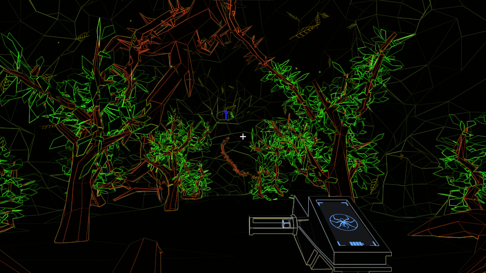
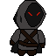

## 🙋‍♂️ About me
I am a Graduate (undergrad) of the Lodz University of Technology with a degree in Applied Computer Science (specialization in Computer Games and Simulations Technologies). I've been creating games for over four years now, starting with the student research circle Digital Night Studio. During the 15th edition of the national ZTGK competition, the teams I was a part of had won 1st place in the Game Development and Mobile Games categories with the games AiPost and Thin LED Line respecively. 
In game production, I primarily focus on programming and design (mechanics, gameplay, levels, and UI), though I also have a strong interest in narrative design and VR technologies.

I usually develop games using the Godot engine, though I also have experience working with Unity and an elemental understanding of Unreal Engine.

## My Projects 
### 🔭 Public projects I'm working on:
- ***CarGo!***, a couch co-op courier simulator for up to 4 players. 

Buy now: [https://store.steampowered.com/app/1272780/CarGo/]

- ***Nycto***, a non-euclidean puzzle-thriller game with an unpararelled atmosphere and unique artstyle.

Play the demo: [https://liptonleon.itch.io/nycto]

- and one yet unnamed project I can't disclose much info about 👀

### 🌱 Private projects I'm toying around with:
- A turn-based RPG framework in Godot, which also includes tools for designers.
- A simple multiplayer FPS (PvP) game in Unreal Engine.
- And other small, non-programming related side projects, such as learning animations, characted design and pixel art 👾

### 🚢 Finished projects
- ***AiPost***, a game created using our own engine which has won the award in Game Development category during ZTGK 2023. A co-op game for two players which later turned into *CarGo*!
Download here: [[https://liptonleon.itch.io/nycto](https://tollto.itch.io/aipost)]

You can find my full portfolio on my  page - feel free to download and play these games!

## ⚡ Random facts
- I picked up interest in game development way back in primary school. In high school I made a meme-game which never saw the light of the day... then I joined Digital Night Studio and started working on games for serious.
- Speaking of Digital Night Studio, I gave a talk about the basics of Godot Engine, combined with a live coding session in 2023. I am about to give another talk very soon - about a more advanced and quite underexplored topic this time!
- My thesis was focused on researching the impact of FoV on effectiveness of task completion in immersive virtual environments.

<!--
**Kris0211/Kris0211** is a ✨ _special_ ✨ repository because its `README.md` (this file) appears on your GitHub profile.

Here are some ideas to get you started:

- 🔭 I’m currently working on ...
- 🌱 I’m currently learning ...
- 👯 I’m looking to collaborate on ...
- 🤔 I’m looking for help with ...
- 💬 Ask me about ...
- 📫 How to reach me: ...
- 😄 Pronouns: ...
- ⚡ Fun fact: ...
-->
